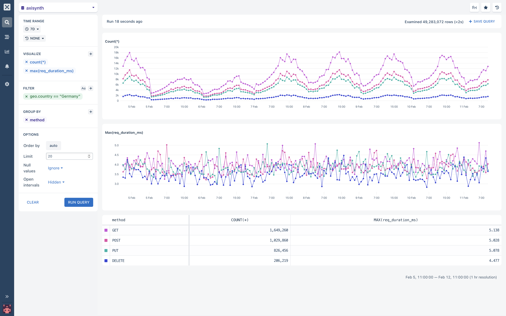
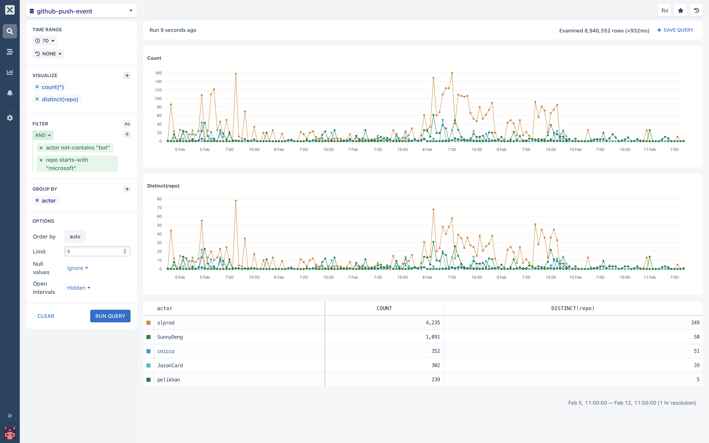
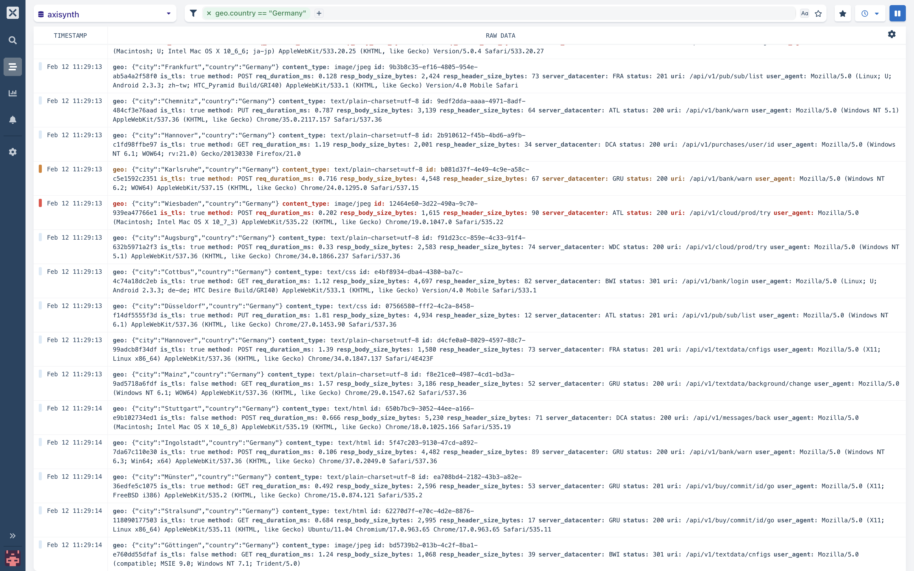

# axiom-demo [](https://github.com/axiomhq/axiom-demo/actions?query=workflow%3ABuild)

Axiom is a logs managment solution that allows you to store, visualize and stream
massive amounts of data from all your apps and services.

### Screenshots:

**Analytics on log-synth**:


**Analytics on GitHub**:


**Tail on log-synth**:



This repo contains a ready-to-go demo to try Axiom locally. It will set up
an Axiom instance, Postgresql, Minio plus some containers for ingestion.
The directories in this repository contain configurations for Dashboards, 
Monitors and ingestion containers.

## Get started

This requires [Docker] and [docker-compose] to be installed:

```sh
git clone https://github.com/axiomhq/axiom-demo.git
cd axiom-demo
docker-compose up -d
```

Open your browser to [:8080] and log in with these 
credentials: 

Email: `demo@axiom.co`  
Password: `axiom-d3m0`

For api access (i.e. with the cli) there is a personal access token: 
`274dc2a2-5db4-4f8c-92a3-92e33bee92a8`.

See [stopping the stack](#stopping-the-stack) for instructions to tear it down
again.

## CLI

In addition to the frontend you can play around with the 
[Axiom CLI]. 

<details>
  <summary>Expand for installation instructions</summary>

On macOS/Linux you can use [Homebrew] to install it with:

```sh
brew tap axiomhq/tap
brew install axiom
```

See the [CLI installation] docs for other installation methods.
</details>

### Log in

Log into your axiom-demo deployment like this:
```sh
echo 274dc2a2-5db4-4f8c-92a3-92e33bee92a8 | axiom auth login --url="http://localhost:8080" --alias="axiom-demo" --token-stdin --token-type personal -f
```

### Use the cli

Run `axiom --help` to see what commands are supported. Here are a few examples:

```sh
# List all datasets
axiom dataset list

# Get detailed information about a single dataset
axiom dataset info minio-traces

# List dataset stats
axiom dataset stats

# Stream logs into your terminal
axiom stream postgres-logs

# Create a dataset
axiom dataset create --name my-dataset --description "My dataset"

# Ingest into a dataset
axiom ingest my-dataset < file.json
```

## Stopping the stack

Run `docker-compose stop` to stop the stack, `docker-compose start` to start
it again.

If you want to clean up, run `docker-compose down -v` to remove all containers 
and volumes. The docker images will persist on your machine unless you manually
delete them.

[Docker]: https://docs.docker.com/engine/install/
[docker-compose]: https://docs.docker.com/compose/install/
[Homebrew]: https://brew.sh
[Axiom CLI]: https://github.com/axiomhq/cli
[CLI installation]: https://github.com/axiomhq/cli#installation
[:8080]: http://localhost:8080
